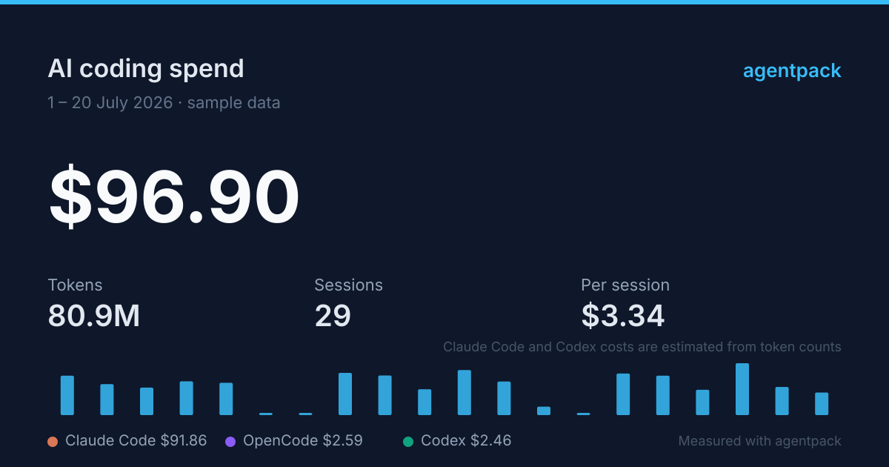

<div align="center">

# agentpack

**See what your AI coding actually costs — and manage every CLI's setup in the same app.**

A cross-platform desktop app for Claude Code, Codex, OpenCode and Pi: read your real
spend from your own session history, then install CLIs, switch accounts and
mirrors, and manage skills and MCP servers — without leaving the window.

[中文文档](./README_zh.md) · [Releases](https://github.com/Arxtect/agentpack-gui/releases) · [Contributing](./CONTRIBUTING.md)



<sub>The card above is generated by agentpack itself (sample data). You can export your own from the usage dashboard.</sub>

</div>

---

## Why

`ccusage` and friends will tell you what your agents cost. Your CLIs' config
files will tell you how they're set up. Nothing connects the two — so the moment
the number surprises you, you're back in a terminal editing JSON by hand.

agentpack puts both in one window. See the spend, then act on it: switch to a
cheaper provider, point at a mirror, turn off an MCP server you never use.

Everything is read from and written to the files the CLIs already use. There is
no account, no telemetry, and no server — agentpack reads your disk and nothing
leaves your machine.

## What it does

**Spend & history**

- Reads Claude Code (JSONL), Codex (rollout JSONL), OpenCode (SQLite), and Pi
  (v1–v3 tree JSONL) session
  history straight off disk, read-only.
- Month-to-date spend on the home screen; a full dashboard with cost trends,
  5-hour billing windows, burn rate, per-model and per-project breakdowns.
- Costs are **exact** where the source records them (OpenCode), identified as a
  **source estimate** where Pi records `usage.cost.total`, and **estimated from
  token counts** elsewhere. A model with no known rate is reported as
  unpriced, never as a real `$0`.
- Browse and read past transcripts, including sub-agent runs.
- Export CSV/JSON for spreadsheets, or a shareable card / Markdown summary.

**Setup & configuration**

- Install or upgrade Claude Code, Codex, OpenCode, Pi, cc-switch and cc-connect,
  plus the Node / Bun / Python / uv runtimes they need. On Windows 10 2004 and
  later, agentpack also detects and installs Windows Terminal when it is missing.
  Commands stream live output, and in-place upgrades match how each tool was
  installed.
- **Pi management** for global/project packages, resource filters, project
  trust visibility, and redacted provider authentication status. Login/logout
  stays in Pi's official interactive flow.
- **Skills** manager across `~/.claude`, `~/.codex`, `~/.opencode`, `~/.pi/agent` and
  `~/.agents`: browse what's installed, install from a GitHub repo, check for
  updates, back up before deleting, resolve name conflicts.
- **MCP servers**: a curated catalog plus search against the official MCP
  registry, health probes that actually run the `initialize` handshake, and
  import/export of `mcpServers` blocks.
- **Network / mirrors** and proxy setup, including a real request test through
  the proxy before you commit to it.
- **cc-switch** provider and account management (its SQLite DB, with backups),
  and **cc-connect** bridge control.

**How it behaves**

- **Dry-run preview**: see every "would write / would run" line before anything
  touches your disk. In preview mode no mutating command is called at all.
- Bilingual (English / 简体中文).
- Saves and restores your whole setup as a config file.

## Install

Download the installer for your platform from
**[Releases](https://github.com/Arxtect/agentpack-gui/releases/latest)**:

| Platform | File                    |
| -------- | ----------------------- |
| macOS    | `.dmg`                  |
| Windows  | `.msi` or `.exe` (NSIS) |
| Linux    | `.AppImage`, `.deb`     |

Once installed, agentpack updates itself — check for updates in **About**.

### ⚠️ macOS says the app "is damaged"

It isn't. This build is not notarized yet (Apple charges $99/year for that), and
macOS shows that misleading message for any unnotarized download. Move the app
to Applications, then run this once:

```bash
xattr -dr com.apple.quarantine /Applications/agentpack.app
```

Maintainers: [`src-tauri/MACOS_SIGNING.md`](src-tauri/MACOS_SIGNING.md) is the
one-time setup that retires this note for good.

### ⚠️ Windows SmartScreen warning

Click **More info** → **Run anyway**. Same cause: the installer isn't signed yet.

## FAQ

**Does it send my data anywhere?**
No. There is no telemetry and no backend. Session history is read from your disk
and stays there. The only outbound requests are the ones you ask for: fetching a
skill from GitHub, querying the MCP registry, checking npm for a newer CLI
version, testing a proxy or provider, and checking for app updates.

**Are the costs accurate?**
They are exact for OpenCode, which records real costs. For Claude Code and Codex
they are estimated from token counts using the price table in
[`lib/history/pricing.ts`](./lib/history/pricing.ts) — a subscription plan will
not match, since you aren't billed per token. Unpriced models are reported as
unpriced rather than folded into the total.

**Does it work if I only use one CLI?**
Yes. Everything is per-tool; the sections for tools you don't have simply show
nothing to do.

**Why is the first launch slow?**
The first scan parses every transcript on disk, which can take ~17 seconds on a
large history. It is cached afterwards, so later launches take ~200 ms.

**Does it change my config files without asking?**
No. Turn on dry-run to see every planned write first, and every real run streams
the exact commands and diffs. cc-switch's database is backed up before writes.

## Building from source

Requires **Node 20+**, **pnpm 10+** and **Rust 1.95+**.

```bash
git clone https://github.com/Arxtect/agentpack-gui.git
cd agentpack-gui
pnpm install
pnpm tauri dev     # desktop app with hot reload
pnpm tauri build   # production installer
```

`pnpm dev` runs the UI in a browser at <http://localhost:3000>, which is useful
for layout work — but everything that touches your system is a Tauri command, so
installs, scans and file writes only work in the desktop app.

Architecture, project layout, testing and the contribution workflow are all in
**[CONTRIBUTING.md](./CONTRIBUTING.md)**.

## License

[MIT](./LICENSE)
